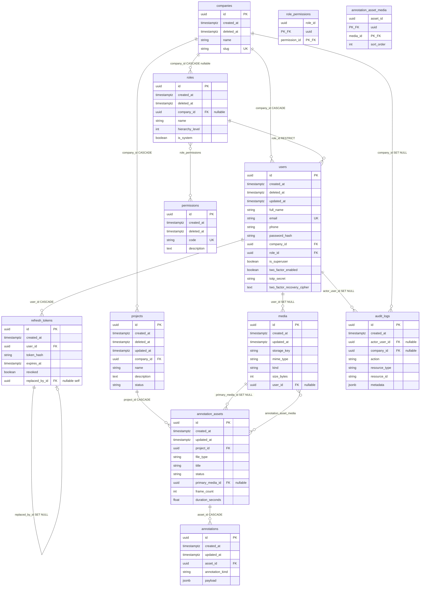

# Annotra database schema (ERD)

This document reflects the SQLAlchemy models under `backend/models/`.

## Entity–relationship diagram



## Tables (physical names)

| Table | Model | Notes |
| --- | --- | --- |
| `companies` | `Company` | Soft delete; unique `slug`. |
| `users` | `User` | Soft delete; unique `email`; belongs to company and role. |
| `roles` | `Role` | Soft delete; `company_id` nullable (shared vs company-scoped roles). |
| `permissions` | `Permission` | Soft delete; unique `code`. |
| `role_permissions` | association | Composite PK `(role_id, permission_id)`; both CASCADE on delete. |
| `projects` | `Project` | Soft delete; scoped to company. |
| `media` | `Media` | No soft delete; optional owning user. `kind` values align with `MediaKind` enum (`image`, `video`, `audio`, `model_3d`). |
| `annotation_assets` | `AnnotationAsset` | Work item / dataset root; optional `primary_media_id`. |
| `annotation_asset_media` | `AnnotationAssetMedia` | Many-to-many asset ↔ media with `sort_order`. |
| `annotations` | `Annotation` | JSON payload per `annotation_kind`. |
| `refresh_tokens` | `RefreshToken` | Rotation chain via `replaced_by_id`. |
| `audit_logs` | `AuditLog` | `metadata` column mapped as `meta` in ORM. |

## Delete behaviors (FK `ondelete`)

- **CASCADE**: child removed with parent (`users` ← `companies`, `projects` ← `companies`, `roles` ← `companies`, `annotation_assets` ← `projects`, `annotations` ← `annotation_assets`, `annotation_asset_media` rows, `refresh_tokens` ← `users`, `role_permissions` rows).
- **RESTRICT**: cannot delete `roles` while referenced by `users`.
- **SET NULL**: `media.user_id`, `annotation_assets.primary_media_id`, `audit_logs.actor_user_id`, `audit_logs.company_id`, `refresh_tokens.replaced_by_id`.

## Regenerating `erd.jpg`

Mermaid CLI renders to `.svg`, `.png`, or `.pdf` (not JPEG). Save the `erDiagram` source (without markdown fences) to e.g. `erd.mmd`, then from this directory:

```bash
# If Puppeteer fails with a sandbox error on Linux, use a config file containing:
# { "args": ["--no-sandbox", "--disable-setuid-sandbox"] }

npx -y @mermaid-js/mermaid-cli@latest -p puppeteer.json -i erd.mmd -o erd.png -b white -w 2400
convert erd.png -quality 92 erd.jpg && rm erd.png
```

`convert` is ImageMagick; use `magick erd.png -quality 92 erd.jpg` if your install exposes the `magick` command only.
